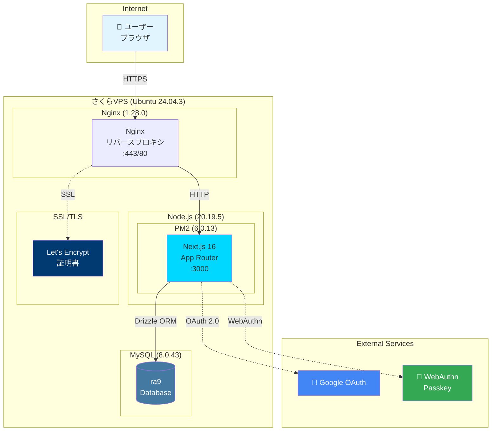
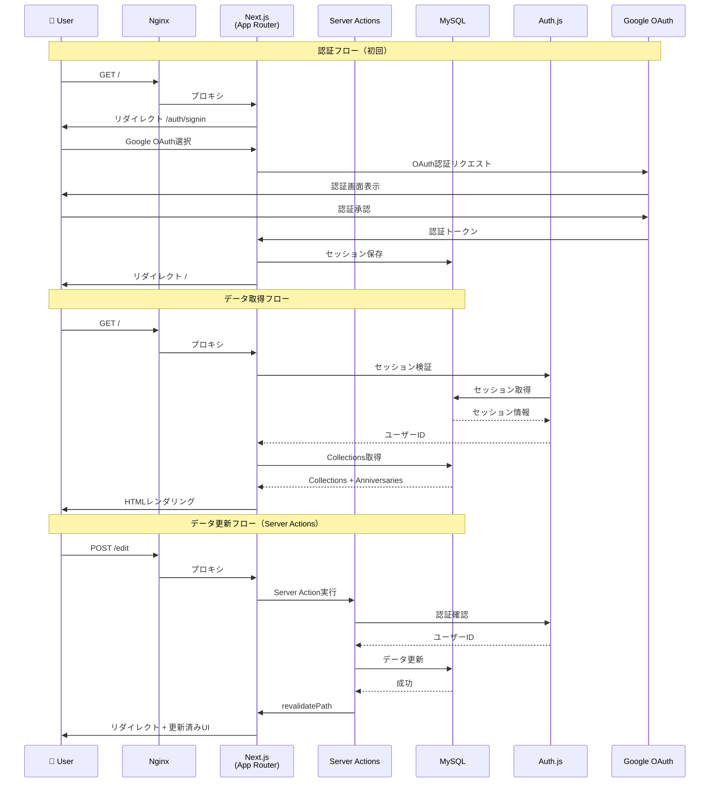
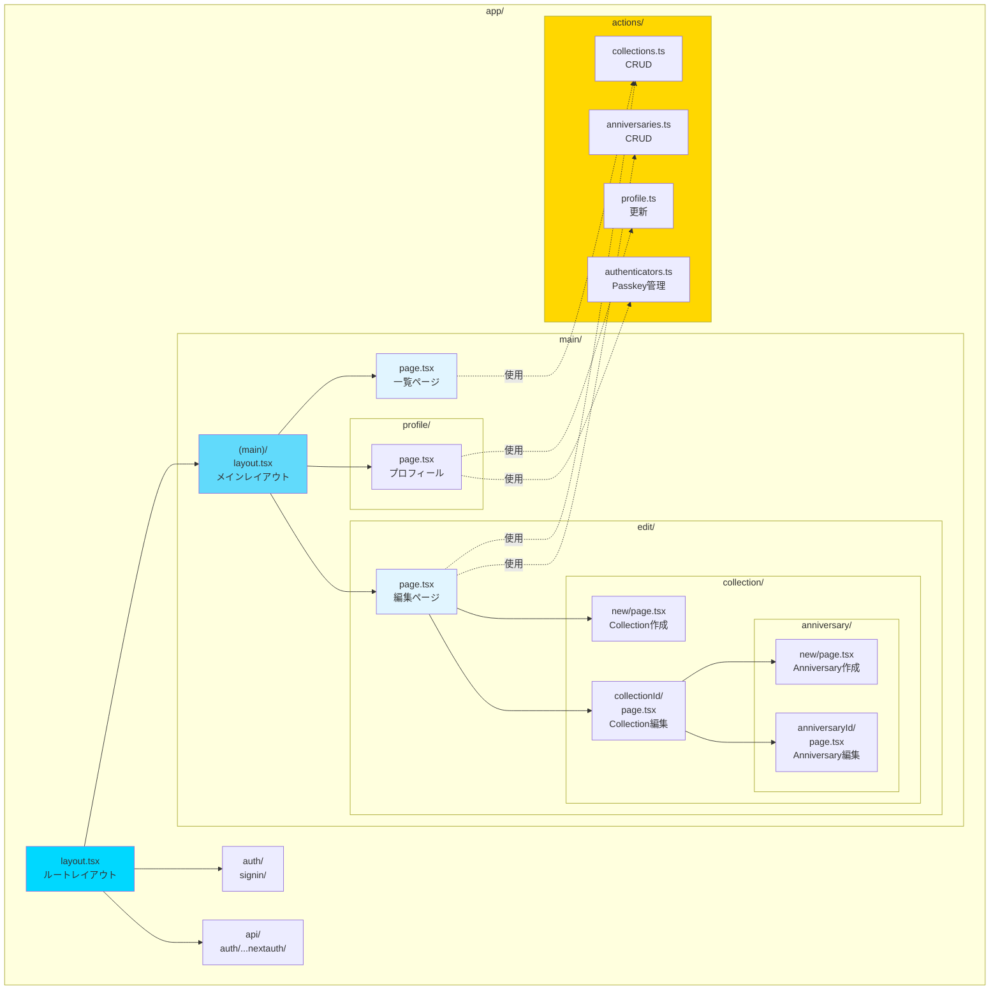
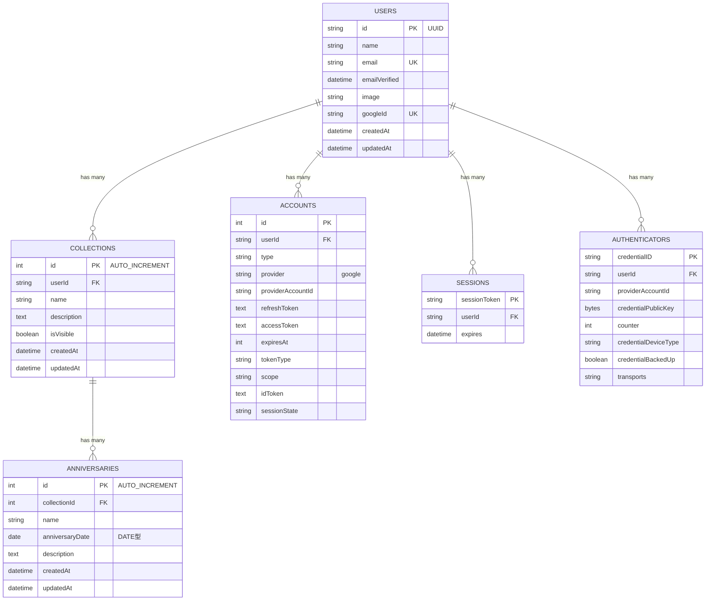
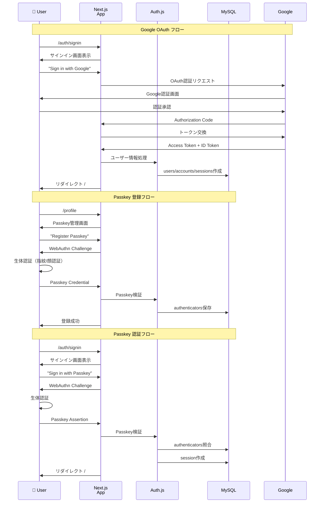

# システムアーキテクチャ

Recording Anniversaries 9のシステムアーキテクチャを図解します。

## 目次

1. [システム構成図](#システム構成図)
2. [データフロー図](#データフロー図)
3. [アプリケーション構造](#アプリケーション構造)
4. [データベーススキーマ](#データベーススキーマ)
5. [認証フロー](#認証フロー)

---

## システム構成図

本番環境のインフラ構成を示します。

### インフラ仕様

| コンポーネント | バージョン | 用途 |
|--------------|----------|------|
| **Ubuntu** | 24.04.3 LTS | OS |
| **Node.js** | 20.19.5 | ランタイム |
| **npm** | 10.8.2 | パッケージ管理 |
| **MySQL** | 8.0.43 | データベース |
| **Nginx** | 1.28.0 | リバースプロキシ、SSL終端 |
| **PM2** | 6.0.13 | プロセス管理、自動再起動 |
| **Let's Encrypt** | - | SSL証明書 |

---

## データフロー図

ユーザーのリクエストがどのように処理されるかを示します。

### データフローの特徴

- **Server Components**: データ取得はサーバーサイドで実行（DBへ直接アクセス）
- **Server Actions**: フォーム送信は型安全なServer Actionsで処理
- **React cache()**: データ取得結果をキャッシュ、重複クエリを削減
- **revalidatePath**: データ更新後、Next.jsキャッシュを無効化

---

## アプリケーション構造

Next.js 16 App Routerの構造を示します。

### ディレクトリ構造の特徴

- **ルートグルーピング**: `(main)/`で認証必須ルートをグルーピング
- **ダイナミックルート**: `[collectionId]`、`[anniversaryId]`でパラメータ受け取り
- **コロケーション**: ルーティングとコンポーネントが同じディレクトリ
- **Server Actions**: `app/actions/`で集中管理

---

## データベーススキーマ

3層モデル（Users → Collections → Anniversaries）を採用。

### スキーマの特徴

- **DATE型**: `anniversaries.anniversary_date`は時刻情報不要のためDATE型
- **CASCADE削除**: Collection削除時、紐づくAnniversariesも自動削除
- **UUID**: Users.idはUUIDで一意性保証
- **Auth.js統合**: accounts, sessions, authenticatorsテーブルでAuth.js v5をサポート

---

## 認証フロー

Google OAuthとPasskey認証の流れを示します。

### 認証の特徴

- **Database Strategy**: セッションをMySQLで管理（スケーラブル）
- **Secure Cookies**: 本番環境では`__Secure-`プレフィックス付き、HTTPS必須
- **Passkey**: WebAuthn標準準拠、クロスデバイス対応（Conditional UI）
- **セッション有効期限**: デフォルト30日（設定可能）

---

## 技術スタック

### フロントエンド
- **React 19**: useActionStateでフォーム状態管理
- **Next.js 16**: App Router、Server Components、Server Actions
- **Tailwind CSS v4**: ユーティリティファースト、ダークモード対応
- **TypeScript 5**: Strict mode

### バックエンド
- **Node.js 20.19.5**: ランタイム
- **Drizzle ORM**: 型安全なORМ、MySQL統合
- **Auth.js v5**: Google OAuth、Passkey認証
- **Zod**: スキーマバリデーション

### インフラ
- **さくらVPS**: 仮想プライベートサーバー
- **Ubuntu 24.04.3 LTS**: OS
- **MySQL 8.0.43**: リレーショナルデータベース
- **Nginx 1.28.0**: リバースプロキシ、SSL終端
- **PM2 6.0.13**: プロセス管理
- **Let's Encrypt**: SSL/TLS証明書

---

## 参考資料

- [TECH_DECISIONS.md](../reference/TECH_DECISIONS.md) - 技術選定の詳細
- [ADR](../adr/) - アーキテクチャ決定記録
- [CLAUDE.md](../../CLAUDE.md) - プロジェクト概要

---

**最終更新**: 2025-11-11
